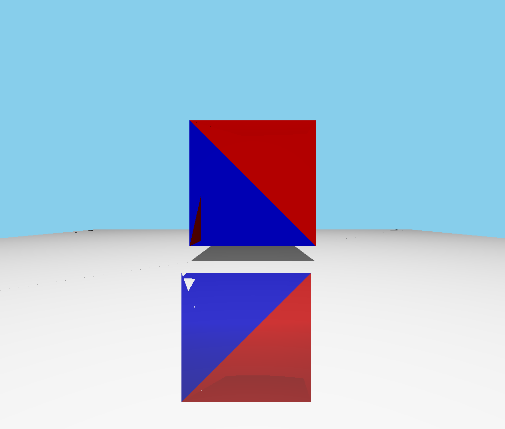
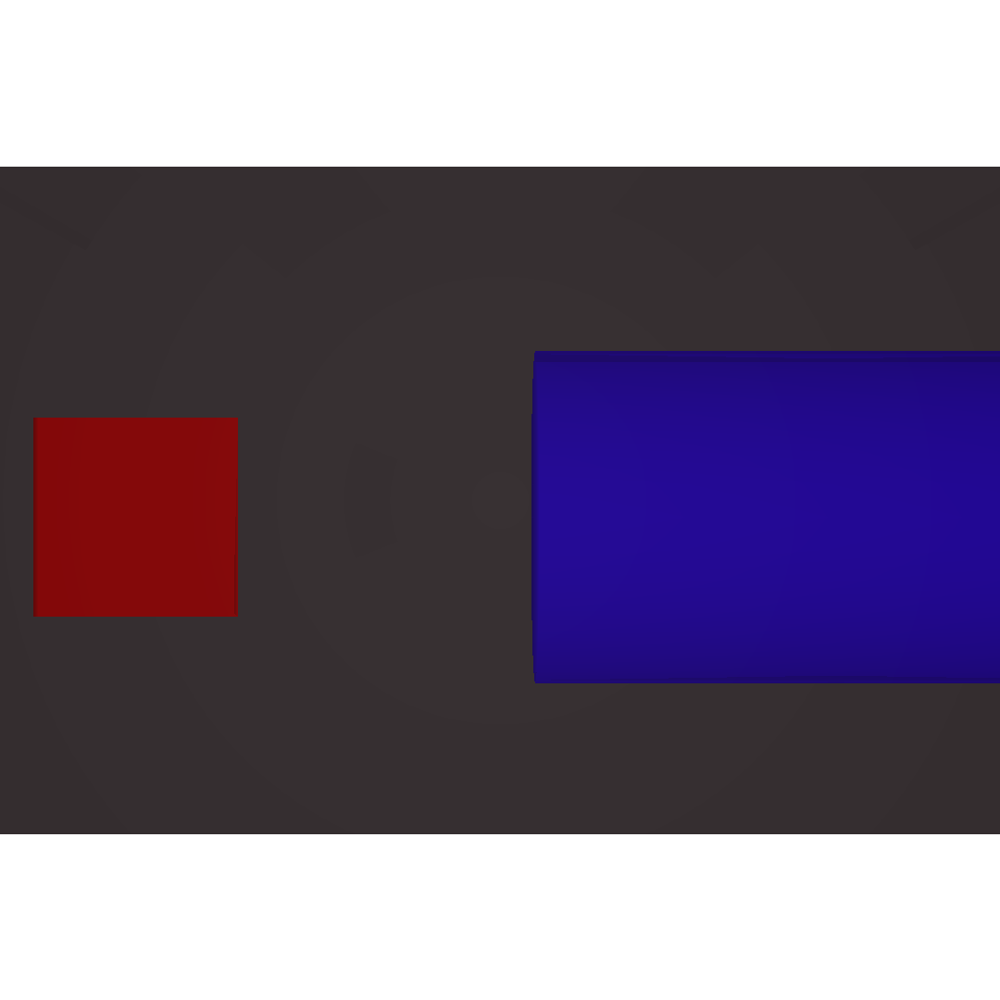

# 336Raytracer

The 336Raytracer is a raytracer I wrote as the final project for my Com S 336 class. When creating the raytracer I followed the article [How to Write a Ray Tracer Intuitively](https://blog.scottlogic.com/2020/03/10/raytracer-how-to.html) by Steven Waterman which helped me learn the process of creating a Raytracer however it doesn't include any example code. This means I gained the experience of translating the proccess into code. 

While working on this project I learned a lot about graphics programming, programming vector math, and working with .obj and .mtl files.

## Results

| Floating Cube Scene | Objects Behind Camera Scene |
| :------------------:| :--------------------------:|
|  |  |
| This is a simple scene in which a cube is floating above a reflective surface and a light source is positioned above the cube. It demonstrates both reflections and a shadow. | In this scene the camera is positioned facing a rectangular prism with a reflective surface and with a cube and a cylinder behind it. The cube and cylinder are visble reflected in the prism. |

## Design 

The raytracer is composed of three parts.
1. **The file parsers:** The scenes to be rendered by the raytracer are specified by [.obj files](https://en.wikipedia.org/wiki/Wavefront_.obj_file) (along with the companion .mtl files). The program includes partially implemented parsers to read these files and extract the necessary information. Additionally, a simple parser reads the configuration files.
2. **The Raytracer:** This is the primary component of the program; it contains all of the logic related to rendering the image. Within this component the program calculates casting rays through every pixel of the image, finding the closest the intersection point with a face, and calculating the color of that face based on its materials and secondary reflection and shadow rays,
3. **The file writers:** The file component writes the calculated pixel colors to a `.ppm` file and then uses a python script to convert that to a png image.

## How to Build and run the program

1. The program can be built by running the make command in the terminal
2. To run the resulting bin enter `./raytrace336` followed by any arguments
3. The program has 2 required and one optional argument \
    a. The first argument is the path to the `.obj` file for the raytracer to render \
    b. The second argument is the path to the `.mtl` used to give the materials applied to the faces in the `.obj` \
    c. The third argument is optional and is the path to a .config used to control the raytracer. Example `.config` files can be found at
    test-models/RecommendedConfigs.

### Examples to run

`./bin/raytrace336 test-models/FloatingCube.obj test-models/FloatingCube.mtl test-models/RecommendedConfigs/FloatingCube.config`

`./bin/raytrace336 test-models/CubeReflection.obj test-models/CubeReflection.mtl test-models/RecommendedConfigs/CubeReflection.config`

`./bin/raytrace336 test-models/ReflectionNoView.obj test-models/ReflectionNoView.mtl test-models/RecommendedConfigs/ReflectionNoView.config`
